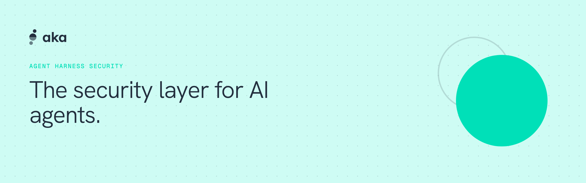
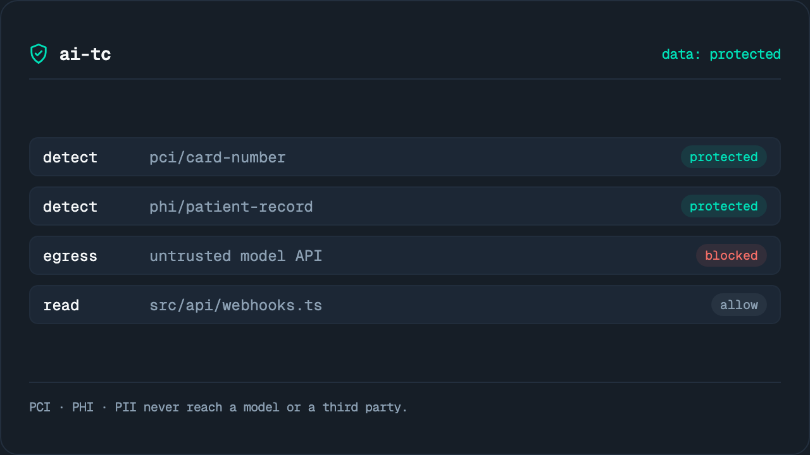

<picture>
  <source media="(prefers-color-scheme: dark)" srcset="assets/hero-dark.png">
  
</picture>

# AKA Security

Sensitive-data detection and protection for every tool call, MCP server, and RAG pipeline.


[](https://akasecurity.io)

<p>
  
</p>

## Projects

- **[AI Traffic Control](https://github.com/akasecurity/ai-tc)** (`ai-tc`) — guardrails for the agent harness: regulated data stays on your machine, and every prompt and tool call is scanned before it runs.  
- **[claude-tools](https://github.com/akasecurity/claude-tools)** (`aka-claude-tools`) — the security defaults Claude Code doesn't ship with: clean context, locked-down credentials, guarded egress, layered onto an isolated profile. 
- **[flightcrew-skills](https://github.com/akasecurity/flightcrew-skills)** (`flightcrew`) — a second opinion before you merge: an independent multi-model review crew for coding agents. Report-only, cross-family. 
- **[marketplace](https://github.com/akasecurity/marketplace)** — one place to install every AKA Security tool, across Claude Code, Codex, and more.

## Install

Claude Code and Codex install from one marketplace — **[akasecurity/marketplace](https://github.com/akasecurity/marketplace)**:

```bash
# Claude Code
/plugin marketplace add akasecurity/marketplace
/plugin install flightcrew@akasecurity

# Codex
codex plugin marketplace add akasecurity/marketplace
codex plugin add flightcrew@akasecurity

# Antigravity — direct repo install (no marketplace mechanism)
agy plugin install https://github.com/akasecurity/flightcrew-skills
```

Standalone CLI, no coding agent: `brew install akasecurity/tap/<tool>` via the [Homebrew tap](https://github.com/akasecurity/homebrew-tap).

Each project is licensed in its own repository · <https://akasecurity.io>
